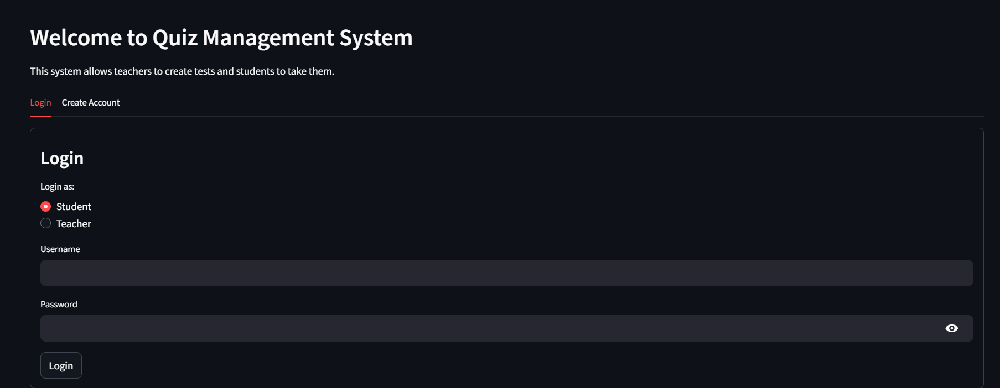
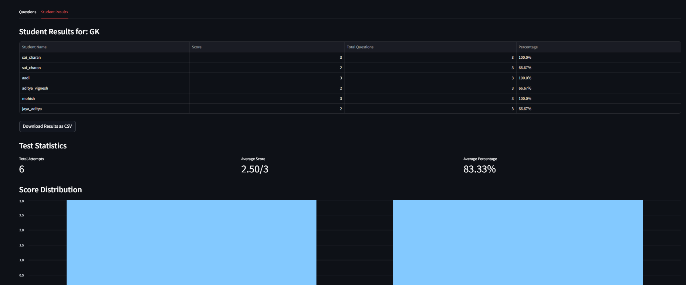

# 📝 Quiz Management System

A web-based quiz management system built with **Streamlit** and **MySQL** that allows **teachers to create and manage quizzes** and **students to take tests and view scores**. The system supports user authentication, test creation, answer submission, result calculation, and score viewing in an interactive and user-friendly interface.

---

## 🔧 Features

### 👩‍🏫 For Teachers:

* Secure login as admin.
* Create new tests with custom questions and options.
* Automatically store tests in a structured MySQL database.
* View all created tests and student scores for each test.

### 👨‍🎓 For Students:

* Register and login with a unique username and numeric password.
* View available tests (only those not yet attempted).
* Attempt quizzes with real-time answer selection.
* Submit answers and view score immediately after completion.

---

## 🗃️ Tech Stack

* **Frontend/UI**: [Streamlit](https://streamlit.io/)
* **Backend**: Python
* **Database**: MySQL
* **Connector**: `mysql-connector-python`

---

## 📁 Project Structure

```
📦 quiz-management-system
 ┣ 📜 app.py               
 ┗ 📦 database               
```

---

## 🛠️ Setup Instructions

### 1. Clone the repository

```bash
git clone https://github.com/yourusername/quiz-management-system.git
cd quiz-management-system
```

### 2. Install Dependencies

```bash
pip install streamlit mysql-connector-python pandas
```

### 3. Set Up MySQL Database

* Create a database named `quiz` in MySQL.
* Create the required tables manually or use the app to generate them:

  ```sql
  CREATE DATABASE quiz;
  USE quiz;

  CREATE TABLE accounts (
    name VARCHAR(100),
    pass INT
  );

  CREATE TABLE tests_available (
    s_no INT,
    test_name VARCHAR(100)
  );
  ```

> Test-specific tables will be auto-generated when a teacher creates a test.

### 4. Run the App

```bash
streamlit run app.py
```

---

## 📸 Screenshots

> ### 🔐 Login Page



### 📊 Result Page


---

## 🚀 Future Enhancements

* Time-bound quizzes with countdown timers.
* Analytics dashboard for teachers.
* Export results to CSV or Excel.
* Responsive UI for mobile devices.

---

